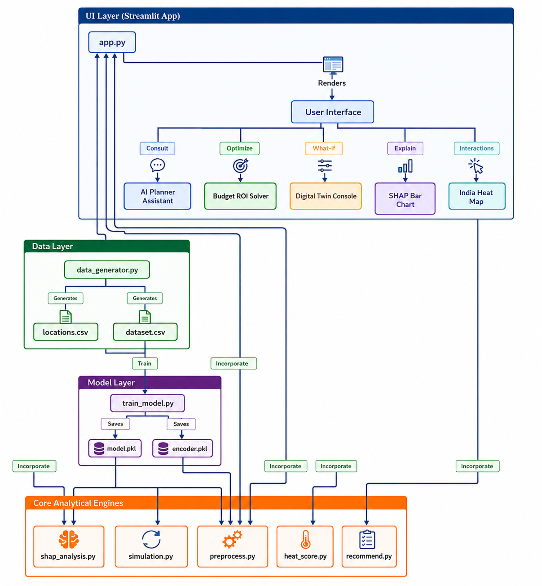

# UrbanCool AI 🏙️
> **Smart City Decision Support Platform for Urban Heat Island (UHI) Mitigation**

UrbanCool AI is a high-fidelity planning and simulation platform designed to model, explain, and mitigate the **Urban Heat Island (UHI)** effect across 50 major cities in India. Aligned with **UN SDG Goal 11 (Sustainable Cities and Communities)**, the system enables civil planners to adjust zoning variables, simulate heat reductions in a digital twin environment, analyze local risk coefficients, and optimize cooling budgets.

---
## 🌐 Project Links

| Resource | Link |
|----------|------|
| 🚀 Live Demo | [UrbanCool AI](https://urbancool-ai-ccwpisrkiz9ktrrepqc7jj.streamlit.app/) |
| 📂 GitHub Repository | https://github.com/pushpa2210/UrbanCool-AI |

# 👩‍💻 Connect with Me
| 💼 LinkedIn Profile | [Pushpa Latha Gorle](https://www.linkedin.com/in/pushpa-latha-gorle-52586b297/) |
📧 Email: pushpag2210@gmail.com
## 🗺️ System Architecture

UrbanCool AI is structured as a modular four-layer system:

# Architecture



### Module Descriptions
* **[data_generator.py](file:///C:/gitam/utils/data_generator.py)**: Generates spatial metadata for 50 cities and simulates a dataset of 20,000 environmental scenarios.
* **[train_model.py](file:///C:/gitam/models/train_model.py)**: Trains a Random Forest Regressor to predict Land Surface Temperature (LST).
* **[preprocess.py](file:///C:/gitam/utils/preprocess.py)**: Maps climate categories and prepares input features for prediction.
* **[heat_score.py](file:///C:/gitam/utils/heat_score.py)**: Computes a standardized multi-factor Heat Risk Index (0–100).
* **[recommend.py](file:///C:/gitam/utils/recommend.py)**: Evaluates UHI mitigation strategies and runs a budget optimization solver.
* **[simulation.py](file:///C:/gitam/utils/simulation.py)**: Clones baseline cities and projects "What-If" thermodynamic scenarios.
* **[shap_analysis.py](file:///C:/gitam/utils/shap_analysis.py)**: Computes dynamic feature attributions using Shapley values.
* **[app.py](file:///C:/gitam/dashboard/app.py)**: Renders the authenticated split-screen interactive Streamlit dashboard.

---

## 🛠️ Tech Stack & Model Decisions

* **Frontend Dashboard**: Streamlit (supports dynamic dark/light themes, vertical navigation tabs, custom CSS styling).
* **Geospatial Mapping**: Folium & Streamlit-Folium (interactive Leaflet.js maps integrated with Python session states).
* **Interactive Plots**: Plotly Express & Plotly Graph Objects (Gauges, Scatter Plots, and SHAP Contribution Bars).
* **Core ML Model**: `RandomForestRegressor` (Scikit-Learn).
  * *Why Random Forest?* Captures complex non-linear thermodynamic interactions; handles multicollinearity among correlated spatial variables (e.g., building, road, and population density); runs in milliseconds for real-time dashboard responsiveness.
* **Explainable AI (XAI)**: SHAP (`shap.TreeExplainer`).
  * *Why SHAP?* Provides mathematically sound local explanations (Shapley values) mapping exactly how much each variable pushes the predicted LST above or below the baseline mean. Using TreeExplainer guarantees fast execution ($O(TLD^2)$ time complexity).
* **Model Persistence**: Joblib (fast serialization for numpy-heavy model files).

---

## 📐 Mathematical & Physical Formulations

### 1. Land Surface Temperature (LST) Generation
The baseline dataset models temperature fluctuations based on solar radiation, density factors, and mitigating surfaces:

Where represents atmospheric noise is adjusted dynamically according to regional climate baselines (e.g., higher for desert zones like Jaipur, lower for mountain zones like Srinagar).

### 2. Heat Risk Index Calculation
The Heat Risk Index normalizes features into a 0-100 range and combines them using the following weights:

The raw score is mapped to a $0 - 100$ scale and categorized:
* **Score < 35**: Low Risk / Cool (Emerald Green)
* **Score 35 – 55**: Moderate Risk (Amber Yellow)
* **Score 55 – 75**: High Risk (Orange)
* **Score > 75**: Extreme Risk (Red)

### 3. Mitigation Strategies & ROI Catalog
The ROI represents LST reduction in **°C per Lakh Rupees (₹ 100,000)** spent:

| Strategy | Unit Cost | LST Cooling | ROI (°C/Lakh) |
| :--- | :--- | :--- | :--- |
| **Urban Forestry & Tree Planting** | ₹15 Lakhs per 1% Green Cover | -0.20 °C | **0.01333** |
| **Cool Roof Coatings (High Albedo)** | ₹150 Lakhs per +0.05 Albedo | -0.60 °C | **0.00400** |
| **Cool & Permeable Pavements** | ₹40 Lakhs per 1% Roads Resurfaced | -0.05 °C | **0.00125** |
| **Intensive/Extensive Green Roofs** | ₹100 Lakhs per 1% Rooftop Greened | -0.12 °C | **0.00120** |
| **Urban Wetland & Pond Restoration** | ₹150 Lakhs per 1% Water Cover | -0.15 °C | **0.00100** |

The system uses a greedy knapsack solver to fill the planning portfolio: it allocates available budget to strategies in descending order of ROI.

---

## 💾 Model Serialization (`.pkl` files)

The `models/` directory contains two serialized artifacts generated during the training phase:
1. **`model.pkl`**: A serialized `RandomForestRegressor` object. Saving it avoids training the model on the 20,000 scenarios during application boot.
2. **`encoder.pkl`**: A dictionary containing the label mapping for categorical climate fields, preventing string encoding mismatch errors between training and inference.

### How to Inspect .pkl Files in Python
Since these are binary files, they cannot be read as plain text. You can inspect them using `joblib` in Python:

```python
import joblib

# Load ML Regressor
model = joblib.load("models/model.pkl")
print("Trained Regressor Parameters:", model)

# Load Label Encoder
encoder = joblib.load("models/encoder.pkl")
print("Climate Mapping:", encoder)
# Output: {'inland': 0, 'coastal': 1, 'plateau': 2, 'desert': 3, 'mountain': 4, 'coastal_plain': 5}
```

---

## 🚀 Installation & Setup

### 1. Install Dependencies
Ensure you have Python 3.9+ installed. Install the required libraries:
```bash
pip install -r requirements.txt
```

### 2. Generate Dataset
Run the data generator to create the location mapping (`locations.csv`) and the scenarios dataset (`dataset.csv`):
```bash
python utils/data_generator.py
```

### 3. Train the Model
Fit the Random Forest model and serialize the output files:
```bash
python models/train_model.py
```

### 4. Run the Tests
Verify that all preprocessing, prediction, risk calculation, ROI selection, and SHAP analyses work successfully:
```bash
python test_pipeline.py
```

### 5. Launch the Dashboard
Run the Streamlit frontend app:
```bash
streamlit run dashboard/app.py
```

---

## 🤖 AI Urban Planner Assistant

The dashboard includes a dedicated diagnostic planning assistant. It runs as a **deterministic local expert system** (matching user queries to regional climate configurations) to ensure fast responses and alignment with the numerical dashboard engines.

* **Jaipur/Desert queries**: Focuses advice on high-albedo coatings to combat high solar radiation.
* **Delhi/Inland queries**: Directs priorities toward transit-lane afforestation and cool roofs.
* **Mumbai/Coastal queries**: Highlights humidity considerations, advising on coastal wetland restoration and building density caps to facilitate natural sea breezes.
* **General cooling/mitigation queries**: Dynamically interfaces with `recommend.py` to identify and output the highest ROI cooling strategy for the currently selected city.
# UrbanCool-Air
